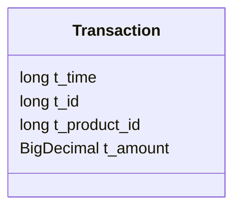
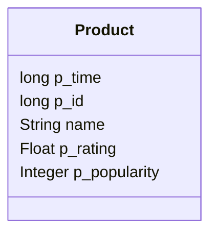
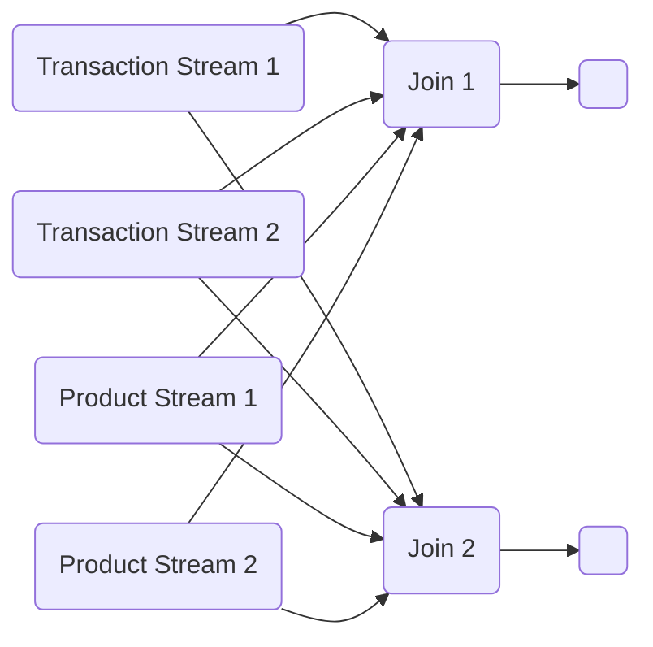

# An enrichment join that waits for missing data

<GithubLink recipe='enrichment-join-with-buffering' />

## Introduction

This recipe illustrates how to use the DataStream API to implement a streaming join for enrichment use cases that want to guarantee that every event will be enriched. This implementation avoids some of the drawbacks of the joins from Flink SQL commonly used for enrichment.

This recipe includes examples showing how to work with `ValueState`, `ListState`, and `MapState`.

## Use case

In this recipe you will enrich a stream of `Transaction` events with a stream of `Product` events by joining them on `Transaction.t_product_id = Product.p_id`.





The semantics of this join are that:

1. Each incoming transaction is immediately enriched with the latest available product information.
2. However, if nothing is known about the product, the transaction is buffered. The join then waits to produce a result until after the missing product data becomes available.
3. Stale (out-of-order) product updates are ignored.

Points 2 and 3 above are what make this join different from the join implemented by Flink's `TemporalProcessTimeJoinOperator`.

## Implementation strategy

The basic implementation strategy is this:

* As `Product` update events arrive, store them somewhere, indexed by their `p_id` field.
* As `Transaction` events arrive, send them to the instance responsible for that particular product (using `t_product_id`). That product data has hopefully already been stored there by the previous step.
* For any `Transaction` events that are processed before the matching product data has been ingested and stored, store those transactions in some sort of buffer _in the same instance that will later process and store the missing product data_.

You will achieve the desired data partitioning by shuffling both the `Product` and `Transaction` streams by the product id:

```java EnrichmentJoinWithBuffering.java focus=31:35 mark=34
        DataStream<Transaction> enrichedStream =
                transactionStream
                        .connect(productStream)
                        .keyBy(t -> t.t_product_id, p -> p.p_id)
                        .process(getJoinFunction(listOrMapState));
```

When you deploy this job with a parallelism of 2, the resulting execution graph will have this topology:



All of the transactions and products with certain product IDs will be sent to Join 1, and the rest will be sent to Join 2. 

## Working with keyed state

The instances of the join operator (Join 1 and Join 2) are the logical place to store the state this recipe requires. For each product ID, the join will need:

* the most recent `Product` object
* the `Transaction` objects (if any) waiting for that `Product`

Flink's keyed state API implements a sharded key/value store, where the keys are defined using `keyBy`. In this recipe, the input streams are shuffled with

```java
keyBy(t -> t.t_product_id, p -> p.p_id)
```

and the keys are product IDs. 

Flink offers three types of keyed (or key-partitioned) state, and all three types are used in this recipe. 

### ValueState

`ValueState<Product>` is ideal for storing the most recent `Product` object for each product ID.

### ListState and MapState

You will use either ListState or MapState to keep track of the transactions waiting for the corresponding product data to be processed and stored:

* `ListState<Transaction>`: a list of Transactions for each product ID
* `MapState<UUID, Transaction>`: a map from UUIDs to Transactions for each product ID

Examples of both approaches are included, one in `EnrichmentJoinUsingListState` and the other in `EnrichmentJoinUsingMapState`.

While the implementation that uses ListState is arguably a bit more natural, the implementation based on MapState is more scalable, and should perform better.

## Potential drawbacks of this approach

During the warm-up phase, before all the product events have been ingested, the delay incurred for enrichment is unpredictable, and potentially rather large. But this only has to be done once, during the initial deployment.

In large scale deployments, the number of transactions needing to be buffered during the warm-up phase is potentially very large, which may cause operational headaches. In such cases, another solution for bootstrapping state may be more practical, such as

* Using a `KeyedCoProcessFunction` with state bootstrapped with the State Processor API.
* Using a `BroadcastProcessFunction` that bootstraps its state from a file.

## The full recipe

This recipe is self-contained. You can run the manual tests in the `EnrichmentJoinWithBufferingTest` class to see the full recipe
in action. Those tests use an embedded Apache Kafka and Apache Flink setup, so you can run them directly via Maven or in 
your favorite editor such as IntelliJ IDEA or Visual Studio Code.
