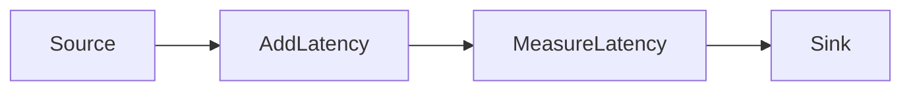
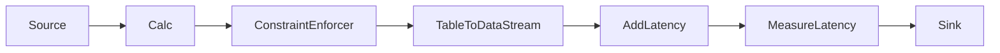

# Measuring latency

## What you can learn from this recipe

This recipe includes code and tests that illustrate:

* How to use Flink's built-in latency metrics.
* How to implement a custom metric for measuring latency, and why you may want to.
* How to use the Table DataGen source connector to generate data for tests.
* How to configure and use the Slf4jReporter.

## Introduction

## The `MeasuringLatency` job

This recipe is measuring the latency for the `MeasuringLatency` job, which has this topology:



Most of the the latency in this job is caused by the sleep in the `AddLatency`
map function:

```java MeasuringLatency.java focus=41:51 mark=46
    private static class AddLatency implements MapFunction<Event, Event> {

        @Override
        public Event map(Event event) throws Exception {
            // cause some additional latency
            Thread.sleep(100);

            // pass the event through (unmodified)
            return event;
        }
    }
```

Because of this `Thread.sleep(100)`, you should expect to see latencies of at least 100 msec.

## Using Flink's built-in latency metrics

You can run the `LatencyMarkersTest#testReportLatencyMetrics` test to see
Flink's built-in latency metrics in action.

This test is configured to run with a parallelism of 2, and it uses
the [Slf4j Metrics Reporter](https://nightlies.apache.org/flink/flink-docs-stble/docs/deployment/metric_reporters/#slf4j) to log a report of the metrics every 10 seconds.

Because the test jobs are using the DataGen Table source connector, they actually have this topology:



Thus when you run this test, you will see 12 entries like one this in the logs:

```
.taskmanager.c96696ae-d05d-4c59-a60a-2dab9ce2c62c
  .Flink Streaming Job.latency.operator_id
  .30ba221650099eb21c298598aa0ee943.operator_subtask_index.0.latency: 
  count=128, min=0, max=1, mean=0.015625000000000007,
  stddev=0.12450690143095285, p50=0.0, p75=0.0, p95=0.0,
  p98=0.4200000000000017, p99=1.0, p999=1.0
```

The 12 entries in this metrics report are showing the frequency distributions of latencies from the sources (collectively) to each of the 2 * 6 operator instances (individually). (Finer-grained latency information can be obtained by adjusting the [`metrics.latency.granularity`](https://nightlies.apache.org/flink/flink-docs-stable/docs/deployment/config/#metrics-latency-granularity) configuration parameter.)

These reported latencies are much lower than expected, because these built-in latency metrics are not based on actual measurements of the end-to-end to latency. 

## Implementing a custom metric

To make it easier to see what's going on, the code in this recipe that measures and reports
the latency has been isolated into a separate `MeasureLatency` map function.
In your applications you might choose instead to include such a metric in one (or more) of the existing operators
(wherever you want to measure and report the latency).

The `MeasureLatency` function in this job creates a histogram metric called `eventTimeLag` in its `open` method:

```java MeasuringLatency.java focus=73:84
        public void open(Configuration parameters) throws Exception {
            super.open(parameters);

            // define a custom histogram metric for measuring latency
            eventTimeLag =
                    getRuntimeContext()
                            .getMetricGroup()
                            .histogram(
                                    "eventTimeLag",
                                    new DescriptiveStatisticsHistogram(eventTimeLagRingBufferSize));
        }
```

_Event time lag_ is the time elapsed since the timestamp in an event. This tells you how long it has taken for the event to reach this point in the pipeline.

As each event passes through the `MeasureLatency` operator, the `eventTimeLag` metric is updated to include that event's _event time lag_. 

```java MeasuringLatency.java focus=64:70 mark=66
        public Event map(Event event) {
            // measure and report the latency
            eventTimeLag.update(System.currentTimeMillis() - event.timestamp.toEpochMilli());

            // pass the event through (unmodified)
            return event;
        }
```

## Inspecting the `eventTimeLag` metric

You can run the `EventTimeLagTest#testReportEventTimeLag` test to see
Flink's the `eventTimeLag` metric in action.

The output (again in the logs) will look approximately like this:

```
.taskmanager.fd7155f5-88a5-43ad-8d5f-f7ef868d34ce
  .Flink Streaming Job.Map.1.eventTimeLag: 
  count=23, min=100, max=112, mean=105.78260869565217, 
  stddev=2.6621338286681113, p50=105.0, p75=107.0, p95=111.8, 
  p98=112.0, p99=112.0, p999=112.0
.taskmanager.fd7155f5-88a5-43ad-8d5f-f7ef868d34ce
  .Flink Streaming Job.Map.0.eventTimeLag: 
  count=23, min=101, max=111, mean=105.6086956521739, 
  stddev=2.709228847590511, p50=106.0, p75=107.0, p95=110.8, 
  p98=111.0, p99=111.0, p999=111.0
```

This time there are only two histograms in the report, one for each of the two parallel instances of the `MeasureLatency` operator.
And, as expected, the results are much more meaningful.

## The full recipe

This recipe is self-contained.
The tests use an embedded Apache Flink cluster, so you can run them directly via Maven or in
your favorite IDE such as IntelliJ IDEA or Visual Studio Code.
