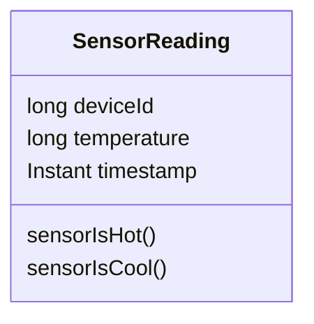
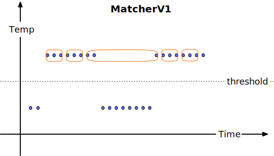
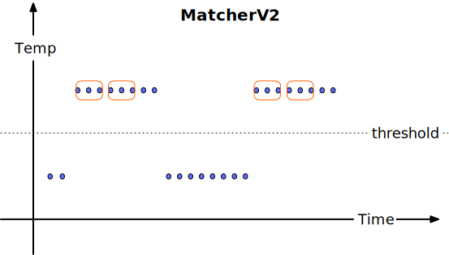
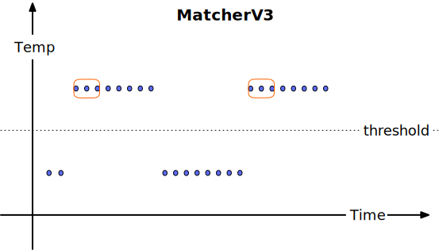

# Using CEP to alert when problems persist

<GithubLink recipe='pattern-matching-cep' />

## Use case: Alert when a sensor remains hot for too long

In this recipe we are working with this data model for a `SensorReading` class:



We are going to focus on detecting when a temperature sensor continuously
reports a temperature that is above some threshold for some pre-determined period of time.

But the same pattern matching logic can be applied to other use cases where streaming analytics
are
used to trigger alerts. For example, you might want to count login attempts per minute, and raise an
alert when that value exceeds some threshold for 3 minutes in a row. Or you might want an alert
whenever a geo-fenced asset has reported itself outside the region where it is authorized to be
for more than one minute.

## Quick intro to Apache Flink's CEP library

Flink includes a Complex Event Processing library (called CEP, for short) that
has [extensive documentation](https://nightlies.apache.org/flink/flink-docs-stable/docs/libs/cep/).

The basic idea is that you define a pattern and apply that pattern to a stream. Every time CEP
succeeds in matching that pattern to the stream, CEP calls a callback you've registered for
processing the matches.

In this recipe, we want to define a pattern that matches as soon as a sensor has been continuously
hot
for some period of time.

Here's an initial attempt to define such a pattern:

```java MatcherV1.java focus=18:28,30
    public Pattern<SensorReading, ?> pattern(Duration limitOfHeatTolerance) {
        AfterMatchSkipStrategy skipStrategy = AfterMatchSkipStrategy.skipPastLastEvent();

        return Pattern.<SensorReading>begin("first-hot-reading", skipStrategy)
                .where(
                        new SimpleCondition<>() {
                            @Override
                            public boolean filter(SensorReading reading) {
                                return reading.sensorIsHot();
                            }
                        })
                .followedBy("still-hot-later")
                .where(new StillHotLater("first-hot-reading", limitOfHeatTolerance));
    }
```

What you are seeing above is a _pattern sequence_ composed of two _singleton patterns_ (each
matching only one event) combined into a sequence with `followedBy`.

The first singleton pattern is named _first-hot-reading_, and it matches any
sensor
reading
satisfying
the condition `reading.sensorIsHot()`.

The second singleton pattern (_still-hot-later_) is more complex. It uses
an `IterativeCondition` to
match sensor readings that are hot and at least `limitOfHeatTolerance` seconds after the
_first-hot-reading_:

```java StillHotLater.java focus=7,18:30
public class StillHotLater extends IterativeCondition<SensorReading> {

    private final String nameOfInitialHotPattern;
    private final Duration limitOfHeatTolerance;

    public StillHotLater(String nameOfInitialHotPattern, Duration limitOfHeatTolerance) {
        this.nameOfInitialHotPattern = nameOfInitialHotPattern;
        this.limitOfHeatTolerance = limitOfHeatTolerance;
    }

    @Override
    public boolean filter(SensorReading thisReading, Context<SensorReading> context)
            throws Exception {

        boolean sensorIsHotNow = thisReading.sensorIsHot();

        SensorReading firstHotReading =
                context.getEventsForPattern(nameOfInitialHotPattern).iterator().next();

        Duration interval = Duration.between(firstHotReading.timestamp, thisReading.timestamp);

        return sensorIsHotNow && interval.compareTo(limitOfHeatTolerance) >= 0;
    }
}
```

This being an `IterativeCondition` is what allows us
to look back at the sensor reading that matched the first-hot-reading part of the pattern sequence
and use it
to measure the time elapsed between that initial sensor reading and the one being currently
considered as a possible match for the _still-hot-later_ condition.

The preliminary solution shown above isn't good enough. While it does successfully find situation
where there are two hot sensor readings far enough apart, it doesn't correctly handle cases where
the sensor has cooled off in-between those two readings.



## Doing a better job

The pattern defined by `MatcherV2` overcomes the problem described above
by inserting an additional condition that requires that the sensor not become
cool
in-between the _first-hot-reading_ and the _still-hot-later_ reading.

```java MatcherV2.java focus=18:38
    public Pattern<SensorReading, ?> pattern(Duration limitOfHeatTolerance) {
        AfterMatchSkipStrategy skipStrategy = AfterMatchSkipStrategy.skipPastLastEvent();

        return Pattern.<SensorReading>begin("first-hot-reading", skipStrategy)
                .where(
                        new SimpleCondition<>() {
                            @Override
                            public boolean filter(SensorReading reading) {
                                return reading.sensorIsHot();
                            }
                        })
                .notFollowedBy("cool-in-between")
                .where(
                        new SimpleCondition<>() {
                            @Override
                            public boolean filter(SensorReading reading) {
                                return reading.sensorIsCool();
                            }
                        })
                .followedBy("still-hot-later")
                .where(new StillHotLater("first-hot-reading", limitOfHeatTolerance));
    }
```

However, if your objective is to generate an alert when the pattern matches, you might be
dissatisfied
with `MatcherV2` because it won't just match once, but will match again and again until the
temperature drops below the threshold:



## Doing an even better job

If you only want to generate one alert from each hot streak, then the solution shown above isn't
good enough. It
could be addressed by
extending the _still-hot-later_ part of the pattern to continue matching until the temperature is no
longer hot — but then the single alert would not be emitted until after the hot streak was over —
and that's unacceptable (assuming you want real-time alerting).

`MatcherV3` overcomes these problems, and also illustrates a somewhat different approach:

```java MatcherV3.java focus=15:39
public class MatcherV3 implements PatternMatcher<SensorReading, SensorReading> {

    public Pattern<SensorReading, ?> pattern(Duration limitOfHeatTolerance) {
        AfterMatchSkipStrategy skipStrategy = AfterMatchSkipStrategy.skipPastLastEvent();

        return Pattern.<SensorReading>begin("starts-cool", skipStrategy)
                .where(
                        new SimpleCondition<>() {
                            @Override
                            public boolean filter(SensorReading reading) {
                                return reading.sensorIsCool();
                            }
                        })
                .next("gets-hot")
                .where(
                        new SimpleCondition<>() {
                            @Override
                            public boolean filter(SensorReading reading) {
                                return reading.sensorIsHot();
                            }
                        })
                .oneOrMore()
                .consecutive()
                .next("stays-hot-long-enough")
                .where(new StillHotLater("gets-hot", limitOfHeatTolerance));
    }
```

With this solution we have

* prevented a continuously hot sensor from matching more than
  once by requiring that each match begin when the sensor is cool
* used a looping pattern (rather than a singleton pattern in combination
  with `notFollowedBy`) to capture the sequence of continuously hot readings
* used `next` rather than `followedBy` to connect the individual patterns

The difference between `next` and `followedBy` is that `next` only matches if there are no events
in-between the two simple patterns being connected, whereas `followedBy` can skip over events that
aren't matched by either of those patterns.

This is the behavior of `MatcherV3`:



## The full recipe

This recipe is self contained. You can run the `ProductionJobTests` to see the full recipe
in action with any of these matchers. Those tests use an embedded Apache Kafka and
Apache
Flink setup, so you can run them directly via
Maven or in your favorite editor such as IntelliJ IDEA or Visual Studio Code.
